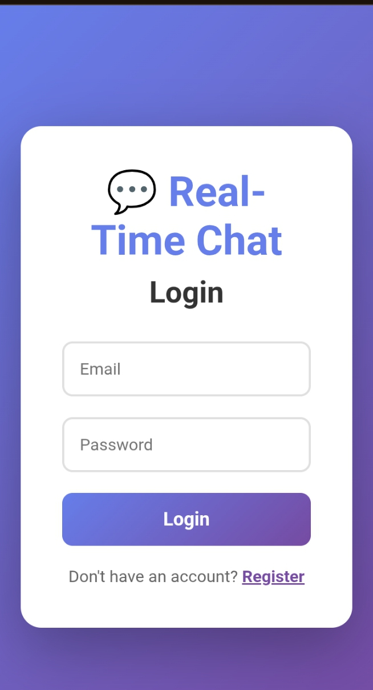
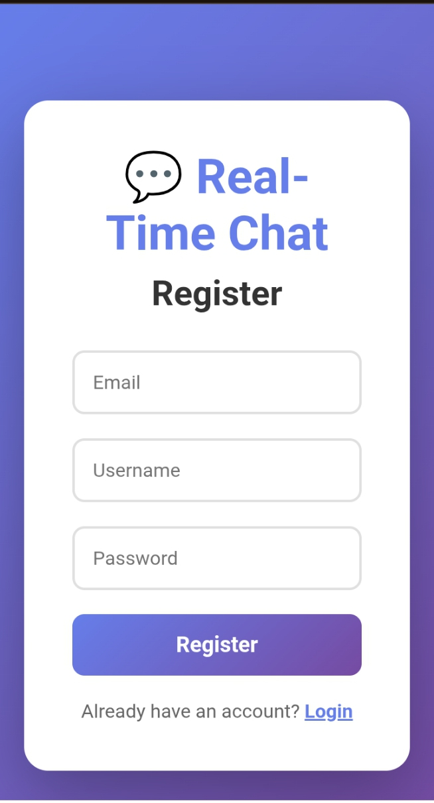
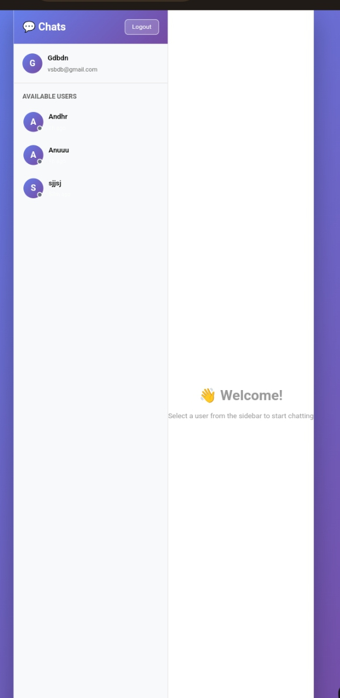

# 📸 Screenshots

This document contains screenshots of the Real-Time Chat Application.

## 🔐 Authentication

### Login Page

*Beautiful gradient login interface with form validation*

### Register Page

*User registration with email, username, and password*

## 💬 Chat Interface

### Main Chat View

*Modern chat UI with user sidebar and message area*

### User Sidebar

*List of available users to chat with*

### Message View

*Real-time message display with timestamps*

### Real-Time Messaging

*Demonstration of instant message delivery*

## 📱 Responsive Design

### Mobile View

*Responsive design for mobile devices*

## 🎨 Features Showcase

### User Profile

*User profile display with avatar*

### Empty State

*UI when no chat is selected*

### Message History

*Persistent message history with scroll*

